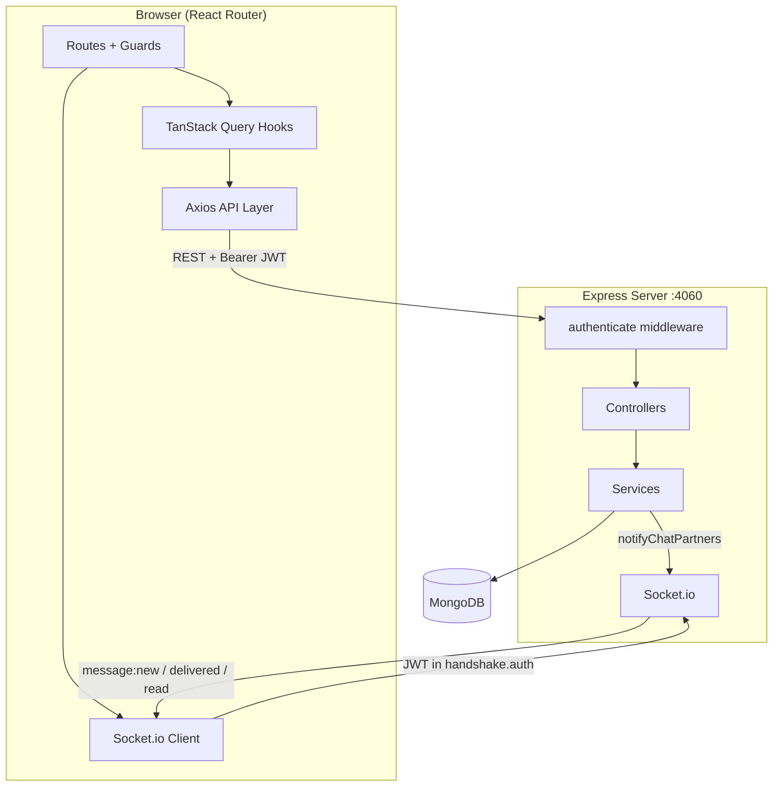

# Gamebook — Complete Project Guide

This document explains how **Gamebook** works end to end: architecture, every major feature, function call chains, critical edge cases, and the messaging bug that was fixed. Use it to understand the project in depth and answer interview or review questions.

---

## Table of Contents

1. [What Is Gamebook?](#1-what-is-gamebook)
2. [Project Structure](#2-project-structure)
3. [How to Run Locally](#3-how-to-run-locally)
4. [High-Level Architecture](#4-high-level-architecture)
5. [Shared Types](#5-shared-types)
6. [Authentication](#6-authentication)
7. [Frontend Deep Dive](#7-frontend-deep-dive)
8. [Backend Deep Dive](#8-backend-deep-dive)
9. [Database Models & Relationships](#9-database-models--relationships)
10. [Feature Workflows](#10-feature-workflows)
11. [Messaging — Full Deep Dive](#11-messaging--full-deep-dive)
12. [The Bug Fix (Conversation Not Found)](#12-the-bug-fix-conversation-not-found)
13. [Critical & Complex Parts](#13-critical--complex-parts)
14. [Quick Reference Tables](#14-quick-reference-tables)

---

## 1. What Is Gamebook?

Gamebook is a **full-stack social platform for gamers**:

- Users sign up / log in with JWT auth
- Create and browse posts (screenshots, reviews, text)
- Comment and reply on posts
- Send friend requests, accept/decline, unfriend
- View profiles (own and others)
- Search users from the navbar
- **1-on-1 real-time chat** with delivery and read receipts (REST + Socket.io)

**Tech stack:**

| Layer | Technology |
|-------|------------|
| Frontend | React 19, React Router 8, TanStack Query 5, Axios, Tailwind CSS 4, Socket.io-client |
| Backend | Express 5, Mongoose 9, JWT, bcryptjs, Socket.io 4 |
| Database | MongoDB |
| Shared types | `types/index.ts` (used by frontend TypeScript) |

---

## 2. Project Structure

```
Gamebook/
├── app/                          # Frontend (React Router)
│   ├── api/                      # Axios client + all API modules
│   │   ├── client.ts             # Axios instance, interceptors
│   │   ├── index.ts              # authApi, postApi, profileApi, etc.
│   │   └── tokenHelpers.ts       # localStorage JWT helpers
│   ├── auth/
│   │   └── guards.ts             # requireAuth / requireGuest
│   ├── components/               # UI components (see section 7)
│   ├── hooks/                    # TanStack Query hooks
│   ├── routes/                   # Page components + layouts
│   ├── utils/                    # chatHelpers, apiError, timeFormatter, postHelpers
│   ├── root.tsx                  # App shell + QueryClientProvider
│   ├── routes.ts                 # Route config
│   └── app.css                   # Tailwind + global styles
├── server/                       # Backend
│   └── src/
│       ├── server.ts             # HTTP server + DB + Socket.io startup
│       ├── app.ts                # Express app + route mounting
│       ├── config/db.ts          # MongoDB connection
│       ├── controllers/          # HTTP request handlers
│       ├── middlewares/          # JWT authenticate middleware
│       ├── models/               # Mongoose schemas
│       ├── routes/               # Express routers
│       ├── services/             # Business logic
│       ├── socket/socket.ts      # Socket.io setup
│       └── types/express.d.ts    # req.user typing
├── types/index.ts                # Shared TypeScript interfaces
├── docs/                         # Documentation (this file)
├── server/docs/MESSAGING.md      # Messaging backend quick reference
└── API.md                        # REST API reference
```

---

## 3. How to Run Locally

**Backend** (port **4060** by default):

```bash
cd server
cp .env.example .env   # set PORT, MONGODB_URI, JWT_SECRET
npm install
npm run dev
```

**Frontend** (port **5173**):

```bash
# in project root
echo "VITE_API_URL=http://localhost:4060" > .env
npm install
npm run dev
```

Both must run. Chat real-time updates require the backend Socket.io server.

---

## 4. High-Level Architecture



**Two communication channels:**

1. **REST (Axios)** — create/read/update data (posts, friends, messages, etc.)
2. **Socket.io** — push live events (new message, delivered, read) without polling

---

## 5. Shared Types

File: `types/index.ts`

These interfaces describe data shape on the frontend. The backend has matching Mongoose models.

| Type | Purpose |
|------|---------|
| `IUser` | Full user record (name, email, gamertag, avatar, bio, role) |
| `IAuthor` | Lightweight user snippet on posts/comments/messages |
| `IProfile` | `{ user: IUser, stats: { totalPosts } }` |
| `IPost` | Post with author, type, game, content, visibility, commentCount |
| `IComment` | Comment with optional `parentComment` for replies |
| `IFriendship` | Friend request (requester, recipient, status) |
| `IFriendEntry` | Accepted friend `{ _id, friend: IAuthor, since }` |
| `FriendshipStatus` | `"none" \| "friends" \| "sent" \| "incoming"` |
| `IConversation` | 1-on-1 chat (2 participants, lastMessage, lastMessageAt) |
| `IMessage` | Text message with `deliveredTo[]` and `readBy[]` |
| `ApiResponse<T>` / `ApiListResponse<T>` | Standard API wrapper `{ success, message?, data }` |

---

## 6. Authentication

### 6.1 Signup Flow

```
User fills signup.tsx form
  └─► useSignup().mutate({ name, gamertag, email, password })
        └─► authApi.signup()  →  POST /api/auth/register
              └─► AuthController.register
                    └─► AuthService.register()
                          ├─► User.findOne({ email }) — reject if exists
                          ├─► User.findOne({ gamertag }) — reject if exists
                          ├─► bcrypt.hash(password, 10)
                          └─► User.create({ name, email, gamertag, password, ... })
        └─► authApi.login({ email, password })  [auto-login after signup]
              └─► AuthController.login → AuthService.login()
                    ├─► User.findOne({ email }).select("+password")
                    ├─► bcrypt.compare(password, user.password)
                    └─► jwt.sign({ _id: user._id.toString(), role }, JWT_SECRET, { expiresIn: "7d" })
        └─► onSuccess: setToken(token) in localStorage (key: gamebook_token)
              └─► navigate("/")
```

### 6.2 Login Flow

```
login.tsx → useLogin().mutate({ email, password })
  └─► POST /api/auth/login → jwt.sign → setToken → navigate(redirectTo)
```

The `redirectTo` comes from `?redirect=/chat/abc` if the user was sent to login from a protected page.

### 6.3 Token Storage

File: `app/api/tokenHelpers.ts`

| Function | What it does |
|----------|--------------|
| `getToken()` | Read `gamebook_token` from localStorage |
| `setToken(token)` | Save token after login/signup |
| `clearToken()` | Remove token on logout or 401 |

### 6.4 Attaching Token to Requests

File: `app/api/client.ts`

Every Axios request runs through a **request interceptor**:

```typescript
const token = getToken();
if (token) config.headers.Authorization = `Bearer ${token}`;
```

### 6.5 Backend JWT Verification

File: `server/src/middlewares/auth.middleware.ts` — `authenticate()`

1. Read `Authorization: Bearer <token>` header
2. `jwt.verify(token, JWT_SECRET)` → decoded payload
3. Set `req.user = { ...decoded, _id: String(decoded._id) }`
4. Call `next()` or return 401

**Why normalize `_id` to string?** JWT payloads and MongoDB ObjectIds can differ in type. String comparison is safer everywhere downstream.

### 6.6 Route Guards (Frontend)

File: `app/auth/guards.ts`

| Function | Used in | Behavior |
|----------|---------|----------|
| `requireAuth(request)` | `_protected.tsx` clientLoader | No token → redirect to `/login?redirect=<current path>` |
| `requireGuest()` | `_guest.tsx` clientLoader | Has token → redirect to `/` |

Both layouts set `clientLoader.hydrate = true` so guards run on the client after hydration.

### 6.7 Global 401 Handling

File: `app/api/client.ts` — response interceptor

On HTTP 401 (except on `/login` or `/signup`):
1. `clearToken()`
2. `window.location.href = /login?redirect=...`

This logs the user out if their token expired or is invalid.

### 6.8 Logout

File: `app/components/Navbar.tsx`

```
queryClient.clear()  →  authApi.logout() (clearToken)  →  navigate("/login")
```

Clearing the query cache prevents stale data from the previous user showing up.

---

## 7. Frontend Deep Dive

### 7.1 Route Map

File: `app/routes.ts`

**Guest layout** (`_guest.tsx` — must NOT be logged in):

| URL | Component | Purpose |
|-----|-----------|---------|
| `/login` | `login.tsx` | Login form |
| `/signup` | `signup.tsx` | Registration form |

**Protected layout** (`_protected.tsx` — must be logged in):

| URL | Component | Purpose |
|-----|-----------|---------|
| `/` | `home.tsx` | Public post feed |
| `/profile` | `profile.tsx` | Own profile + edit + friendship panel |
| `/users/:userId` | `users.$userId.tsx` | Another user's profile |
| `/posts/new` | `posts.new.tsx` | Create post |
| `/posts/mine` | `posts.mine.tsx` | Your posts |
| `/posts/:id` | `posts.$id.tsx` | Post detail + comments |
| `/chat` | `chat.tsx` | Chat (friends list, no friend selected) |
| `/chat/:friendId` | `chat.$friendId.tsx` | Chat with a specific friend (re-exports `chat.tsx`) |

### 7.2 App Shell

File: `app/root.tsx`

- Wraps entire app in `QueryClientProvider`
- Default query options: `staleTime: 5 minutes`, `retry: 1`
- Global error boundary for 404 and runtime errors

### 7.3 API Modules

File: `app/api/index.ts`

| Module | Methods | Backend routes |
|--------|---------|----------------|
| `authApi` | `login`, `signup`, `logout` | `/api/auth/*` |
| `profileApi` | `getProfile`, `getById`, `updateProfile` | `/api/users/me`, `/api/users/:id` |
| `postApi` | `getAll`, `getMyPosts`, `getById`, `create`, `update`, `delete` | `/api/post/*` |
| `commentApi` | `getByPost`, `getReplies`, `create`, `delete` | `/api/comments/*` |
| `userApi` | `search` | `/api/users/search` |
| `friendsApi` | `list`, `getIncomingRequests`, `getSentRequests`, `sendRequest`, `acceptRequest`, `declineRequest`, `remove` | `/api/friends/*` |
| `conversationApi` | `list`, `create`, `getMessages`, `sendMessage`, `markRead` | `/api/conversations/*` |

**Error messages:** `app/utils/apiError.ts` → `getApiErrorMessage()` extracts the server's `message` field instead of showing generic Axios errors.

### 7.4 Hooks

| Hook file | Exports | Calls |
|-----------|---------|-------|
| `useAuth.ts` | `useLogin`, `useSignup` | `authApi` + `setToken` |
| `useProfile.ts` | `useProfile`, `useUserProfile`, `useUpdateProfile` | `profileApi` |
| `usePosts.ts` | `usePosts`, `useUserPosts`, `useMyPosts`, `usePost`, `useCreatePost`, `useDeletePost` | `postApi` |
| `useComments.ts` | `useComments`, `useReplies`, `useCreateComment`, `useDeleteComment` | `commentApi` |
| `useFriends.ts` | `useFriends`, `useIncomingFriendRequests`, `useSentFriendRequests`, `useSendFriendRequest`, `useAcceptFriendRequest`, `useDeclineFriendRequest`, `useRemoveFriendship`, `useFriendshipStatus` | `friendsApi` |
| `useChat.ts` | `useConversations`, `useChatMessages`, `useStartConversation`, `useSendChatMessage`, `useMarkChatRead` | `conversationApi` |
| `useChatSocket.ts` | `useChatSocket` | Socket.io → updates TanStack Query cache |

**Query key conventions:**

```
["profile"]                          → current user profile
["profile", userId]                  → another user's profile
["posts", page, limit]               → public feed
["posts", "author", authorId, ...]   → posts by user
["myPosts", page, limit]             → own posts
["post", id]                         → single post
["comments", postId]                 → top-level comments
["replies", commentId]               → replies to a comment
["friends"]                          → accepted friends list
["friends", "incoming"]              → incoming requests
["friends", "sent"]                  → sent requests
["conversations"]                    → chat list
["chatMessages", conversationId]     → messages in one chat
```

### 7.5 Components by Feature

**Navigation:** `Navbar.tsx` — links (Feed, My Posts, Chat, Profile), `UserSearch`, logout

**Posts:** `PostCard.tsx`, `CreatePostForm.tsx`, `AuthorLink.tsx`

**Comments:** `CommentSection.tsx` (includes `CommentItem`, `ReplyForm`)

**Profile:** `UserProfileView.tsx`, `EditProfileModal.tsx`

**Friends:** `FriendActionButton.tsx`, `FriendshipPanel.tsx`, `UserSearch.tsx`

**Chat:** `ChatFriendList.tsx`, `ChatWindow.tsx`

**Shared:** `Avatar.tsx`

**Utils:**

| File | Functions | Purpose |
|------|-----------|---------|
| `chatHelpers.ts` | `getUserId`, `getMessageStatus`, `groupMessagesBySender` | Chat display logic |
| `postHelpers.ts` | `getAuthor`, `getAuthorId`, `formatDate` | Post author extraction |
| `timeFormatter.ts` | `timeAgo` | Relative timestamps |
| `apiError.ts` | `getApiErrorMessage` | User-friendly API errors |

---

## 8. Backend Deep Dive

### 8.1 Startup Sequence

File: `server/src/server.ts`

```
1. dotenv.config()
2. createServer(app)           ← Express wrapped in Node HTTP server
3. initSocket(server)          ← Socket.io attached to same HTTP server
4. connectDB()                 ← Mongoose → MongoDB
5. server.listen(PORT || 4060)
```

**Important:** Socket.io shares the same port as REST. Clients connect to `http://localhost:4060`, not a separate WebSocket port.

### 8.2 Express App

File: `server/src/app.ts`

Middleware: CORS (localhost:5173 + `CLIENT_URL`), JSON body parser

Route mounting:

| Prefix | Route file |
|--------|------------|
| `/api/auth` | `auth.routes.ts` |
| `/api/post` | `post.routes.ts` |
| `/api/users` | `user.routes.ts` |
| `/api/comments` | `comment.routes.ts` |
| `/api/friends` | `friends.routes.ts` |
| `/api/conversations` | `conversation.routes.ts` |
| `/api/messages` | `message.routes.ts` |

### 8.3 Layer Pattern

Every feature follows the same pattern:

```
HTTP Request
  → Route (defines URL + HTTP method + authenticate middleware)
    → Controller (reads req.params/body/user, returns JSON response)
      → Service (business logic, DB queries, Socket emits)
        → Model (Mongoose schema)
```

### 8.4 Controllers & Services Map

| Feature | Controller | Service |
|---------|------------|---------|
| Auth | `AuthController` | `AuthService` |
| Users | `UserController` | `UserService` |
| Posts | `PostController` | `PostService` |
| Comments | `CommentController` | `CommentService` |
| Friends | `FriendshipController` | `FriendshipService` |
| Conversations | `ConversationController` | `ConversationService` |
| Messages | `MessageController` | `MessageService` |

### 8.5 Socket.io

File: `server/src/socket/socket.ts`

**Auth:** Token from `handshake.auth.token` or `?token=` query param. Same JWT secret as REST.

**On connect:**
1. Verify JWT → get `userId`
2. Join room `user:${userId}` (one room per user, all their tabs join it)
3. Track in `onlineUsers` Map (supports multiple browser tabs)
4. Emit `connected` event to client

**Helper functions used by MessageService:**

| Function | Purpose |
|----------|---------|
| `isUserOnline(userId)` | Check if user has active socket(s) |
| `sendToUser(userId, event, data)` | Emit to one user's room |
| `notifyChatPartners(userA, userB, event, data)` | Emit to both people in a 1-on-1 chat |

---

## 9. Database Models & Relationships

```
User
 ├── Post.author
 ├── Comment.author
 ├── Friendship.requester / .recipient
 ├── Conversation.participants[2]
 └── Message.sender

Post
 └── Comment.post

Comment
 └── Comment.parentComment (replies)

Conversation
 └── Message.conversation
     └── Conversation.lastMessage (denormalized for fast list sorting)
```

### Model details

**User** (`server/src/models/User.ts`)
- Fields: name, email, gamertag, password (hidden by default), avatarUrl, bio, role
- Pre-delete hook: removes user's posts when account is deleted

**Post** (`server/src/models/Post.ts`)
- Fields: author, type (screenshot/review/text), game, content, images, visibility (public/friends), commentCount
- Public feed only shows `visibility: "public"`

**Comment** (`server/src/models/Comment.ts`)
- Fields: post, author, content, parentComment, replyCount
- Top-level comments have `parentComment: null`
- Replies point to parent comment ID

**Friendship** (`server/src/models/Friendship.ts`)
- Fields: requester, recipient, status (pending/accepted/declined)
- Unique index on requester+recipient pair

**Conversation** (`server/src/models/Conversation.ts`)
- **Exactly 2 participants** — schema validator enforces this
- Fields: participants, lastMessage, lastMessageAt

**Message** (`server/src/models/Message.ts`)
- Fields: conversation, sender, content, deliveredTo[], readBy[]
- `deliveredTo`: `{ user, deliveredAt }` entries
- `readBy`: `{ user, readAt }` entries

---

## 10. Feature Workflows

### 10.1 Public Feed (Home Page)

```
home.tsx renders
  └─► usePosts() → queryKey ["posts", 1, 10]
        └─► postApi.getAll(1, 10) → GET /api/post?page=1&limit=10
              └─► PostController.getAll
                    └─► PostService.getPosts()
                          └─► Post.find({ visibility: "public" })
                                .populate("author", "name gamertag avatarUrl")
                                .sort({ createdAt: -1 })
                                .skip().limit()
  └─► maps results to <PostCard post={...} />
        └─► AuthorLink links to /users/:authorId
        └─► Link to /posts/:id for detail
```

### 10.2 Create Post

```
posts.new.tsx → <CreatePostForm />
  └─► useCreatePost().mutate({ type, game, content, visibility })
        └─► POST /api/post (authenticate required)
              └─► PostService.createPost({ ...body, author: req.user._id })
                    └─► validates author exists → Post.save()
        └─► onSuccess: invalidate ["posts"], ["myPosts"], ["profile"]
              └─► navigate(`/posts/${post._id}`)
```

### 10.3 Post Detail + Comments

```
posts.$id.tsx
  └─► usePost(id) → GET /api/post/:id
  └─► <CommentSection postId={id} />
        └─► useComments(postId) → GET /api/comments/post/:postId
              └─► CommentService.getPostComments (parentComment: null only)
        └─► User types comment → useCreateComment(postId).mutate({ content })
              └─► POST /api/comments { postId, content }
                    └─► CommentService.createComment()
                          ├─► Comment.save()
                          └─► Post.commentCount++ (atomic increment)
        └─► "Show replies" → useReplies(commentId)
              └─► GET /api/comments/:commentId/replies
        └─► Reply form → useCreateComment with parentCommentId
              └─► parent Comment.replyCount++
```

### 10.4 Delete Comment

```
CommentItem delete button
  └─► useDeleteComment(postId).mutate(commentId)
        └─► DELETE /api/comments/:id
              └─► CommentService.deleteComment()
                    ├─► Author OR post owner can delete
                    └─► Deletes comment + all replies (cascade)
                          └─► decrements post.commentCount and parent replyCount
```

### 10.5 Friend Request Lifecycle

**Send request** (from profile or search):

```
FriendActionButton → useSendFriendRequest().mutate(targetUserId)
  └─► POST /api/friends/request/:userId
        └─► FriendshipService.sendRequest(requesterId, recipientId)
              ├─► reject if requester === recipient
              ├─► find existing friendship between pair
              │     ├─ accepted → error "Already friends"
              │     ├─ pending → error "Request already sent"
              │     └─ declined → reset to pending
              └─► Friendship.create({ requester, recipient, status: "pending" })
```

**Accept:**

```
PATCH /api/friends/accept/:requestId
  └─► FriendshipService.acceptRequest()
        ├─► verify recipient === current user
        └─► status = "accepted"
```

**Decline:**

```
PATCH /api/friends/decline/:requestId
  └─► status = "declined"
```

**List friends** (used by profile panel and chat sidebar):

```
GET /api/friends
  └─► FriendshipService.getFriends(userId)
        └─► find accepted friendships where user is requester OR recipient
              └─► map to { _id: friendshipId, friend: otherUser, since }
```

**Derived status** (for buttons on other profiles):

```
useFriendshipStatus(targetUserId) in useFriends.ts
  └─► checks useFriends(), useIncomingFriendRequests(), useSentFriendRequests()
        └─► returns { status: "friends"|"incoming"|"sent"|"none", friendshipId }
              └─► FriendActionButton renders correct action
```

### 10.6 User Profile

**Own profile** (`/profile`):

```
profile.tsx
  └─► useProfile() → GET /api/users/me
        └─► UserService.getProfile() → user + Post.countDocuments
  └─► <UserProfileView isOwnProfile />
        ├─► EditProfileModal → useUpdateProfile() → PATCH /api/users/:id
        ├─► FriendshipPanel (incoming, sent, friends lists)
        └─► useUserPosts(currentUserId) for post list
```

**Other user** (`/users/:userId`):

```
users.$userId.tsx
  └─► useUserProfile(userId) → GET /api/users/:id
  └─► <FriendActionButton targetUserId={userId} />
  └─► useUserPosts(userId)
```

### 10.7 User Search (Navbar)

```
UserSearch component (300ms debounce)
  └─► userApi.search(query) → GET /api/users/search?q=
        └─► UserService.searchUsers()
              └─► regex match on name OR gamertag, exclude self
        └─► results link to /users/:id
              └─► can send friend request from there
```

---

## 11. Messaging — Full Deep Dive

Messaging is the most complex feature. It combines REST for persistence and Socket.io for real-time updates.

### 11.1 Chat Page Load

File: `app/routes/chat.tsx`

When you navigate to `/chat/:friendId`:

```
1. requireAuth() already ran in _protected.tsx

2. useChatSocket() mounts
     └─► io(VITE_API_URL, { auth: { token: getToken() } })
           └─► listens for message:new, message:delivered, message:read
           └─► updates TanStack Query cache directly

3. useProfile() → currentUserId = profile.user._id

4. useFriends() → find activeFriend where friend._id === friendId param

5. useEffect([friendId, currentUserId]):
     └─► useStartConversation().mutate(friendId)
           └─► POST /api/conversations { recipientId: friendId }
                 └─► ConversationController.create
                       └─► ConversationService.getOrCreateConversation(userId, recipientId)
                             ├─► validate not self, other user exists
                             ├─► Conversation.findOne({ participants: { $all: [A,B], $size: 2 } })
                             └─► or Conversation.create with sorted ObjectIds
           └─► onSuccess: setConversationId(conversation._id)

6. When conversationId is set, render <ChatWindow />
```

**Left sidebar** (`ChatFriendList`):
- `useFriends()` for friend list
- `useConversations()` for last message previews
- Each row links to `/chat/:friendId`

### 11.2 Loading Messages

File: `app/components/ChatWindow.tsx`

```
useChatMessages(conversationId)
  └─► GET /api/conversations/:conversationId/messages
        └─► MessageController.list
              └─► MessageService.getConversationMessages(conversationId, userId, page, limit)
                    ├─► ConversationService.getConversationById() ← auth check
                    ├─► Message.find({ conversation }).populate("sender").sort().paginate
                    └─► For each message FROM the other user:
                          ├─► if not in deliveredTo yet → push { user: userId, deliveredAt }
                          ├─► message.save()
                          └─► sendToUser(senderId, "message:delivered", { ... })
                    └─► return messages oldest-first
```

**Also on mount:**

```
useEffect → useMarkChatRead().mutate(conversationId)
  └─► PATCH /api/conversations/:conversationId/read
        └─► MessageService.markConversationAsRead()
              ├─► find unread messages where sender !== current user
              ├─► push to readBy for each
              └─► emit "message:read" to each message's sender
```

### 11.3 Send Button — Complete Nitty-Gritty Trace

This is the full path when you type a message and click **Send**:

#### Step 1: Form submit (Frontend)

File: `app/components/ChatWindow.tsx` → `handleSubmit`

```
1. e.preventDefault()
2. if text is empty → return
3. sendMessage(text.trim(), { onSuccess: () => setText("") })
     └─► this is useSendChatMessage(conversationId).mutate from useChat.ts
```

#### Step 2: TanStack Query mutation (Frontend)

File: `app/hooks/useChat.ts` → `useSendChatMessage`

```
mutationFn: (content) =>
  conversationApi.sendMessage(conversationId, content)
    └─► POST /api/conversations/:conversationId/messages
          body: { content: "hello" }
          header: Authorization: Bearer <token>   ← added by Axios interceptor
```

#### Step 3: Express routing (Backend)

File: `server/src/routes/conversation.routes.ts`

```
POST /:conversationId/messages
  → authenticate middleware (verify JWT, set req.user)
  → MessageController.send
```

#### Step 4: Controller (Backend)

File: `server/src/controllers/message.controller.ts` → `send`

```
1. userId = req.user._id
2. conversationId = req.params.conversationId
3. content = req.body.content
4. MessageService.sendMessage(conversationId, userId, content)
5. return 201 { success: true, data: message }
```

#### Step 5: Service — core logic (Backend)

File: `server/src/services/message.service.ts` → `sendMessage`

```
1. getConversationById(conversationId, senderId)
     └─► loads conversation with populated participants
     └─► isInConversation() check via resolveUserId()
     └─► returns null → throws "Conversation not found or unauthorized."

2. Validate content is non-empty trim

3. getOtherUserId(conversation, senderId) → the friend's user ID

4. Message.create({
     conversation, sender, content,
     deliveredTo: [{ user: senderId, deliveredAt: now }],   ← sender always "delivered" to self
     readBy: [{ user: senderId, readAt: now }]              ← sender always "read" by self
   })

5. if isUserOnline(otherUserId):
     message.deliveredTo.push({ user: otherUserId, deliveredAt: now })
     message.save()

6. conversation.lastMessage = message._id
   conversation.lastMessageAt = message.createdAt
   conversation.save()

7. populate message sender fields

8. notifyChatPartners(senderId, otherUserId, "message:new", {
     conversationId,
     message: populatedMessage,
     conversation: populatedConversation
   })
     └─► sendToUser(senderId, "message:new", data)
     └─► sendToUser(otherUserId, "message:new", data)
```

#### Step 6: Mutation success (Frontend)

File: `app/hooks/useChat.ts` → `useSendChatMessage` onSuccess

```
1. queryClient.setQueryData(["chatMessages", conversationId], old => [...old, message])
     └─► message appears immediately in ChatWindow (no wait for socket)

2. queryClient.invalidateQueries({ queryKey: ["conversations"] })
     └─► refreshes friend list last-message previews
```

#### Step 7: Socket update (Frontend — both users)

File: `app/hooks/useChatSocket.ts` → `on("message:new")`

For the **other user** (who didn't click Send):

```
1. Append message to ["chatMessages", conversationId] cache (if not duplicate)
2. Update ["conversations"] list with new lastMessage / lastMessageAt
```

For the **sender** (you): the REST onSuccess already added the message. Socket handler skips duplicates by checking `item._id === message._id`.

#### Step 8: UI re-render (Frontend)

File: `app/components/ChatWindow.tsx`

```
1. messages array updated → groupMessagesBySender(messages)
2. Each group shows avatar + name + time once, messages below
3. getMessageStatus(message, currentUserId, otherUserId):
     └─► if other user in readBy → "[seen]"
     └─► else if other user in deliveredTo → "[delivered]"
     └─► else → "[sent]"
4. bottomRef.scrollIntoView({ behavior: "smooth" })
5. input cleared (onSuccess callback)
```

#### Step 9: Delivery & read receipts (async, after the fact)

When the **recipient** has the chat open:

```
Loading messages OR receiving socket event
  └─► markConversationAsRead runs
        └─► PATCH /read → pushes readBy → emits "message:read" to sender

Sender's useChatSocket receives "message:read"
  └─► updates readBy in ["chatMessages", conversationId] cache
  └─► getMessageStatus now returns "[seen]"
```

### 11.4 Message Status Display

File: `app/utils/chatHelpers.ts`

```typescript
getMessageStatus(message, currentUserId, otherUserId)
  → only shown on YOUR messages (sender === currentUserId)
  → checks otherUserId in message.readBy → "[seen]"
  → checks otherUserId in message.deliveredTo → "[delivered]"
  → else "[sent]"
```

Backend mirror: same logic, but `MessageService` writes the arrays; frontend only reads them.

### 11.5 Message Grouping

File: `app/utils/chatHelpers.ts` → `groupMessagesBySender`

Consecutive messages from the same sender are grouped so avatar/name/timestamp appear once (Discord-style).

### 11.6 Frontend Chat Files Summary

| File | Role |
|------|------|
| `routes/chat.tsx` | Page layout, starts conversation, mounts socket |
| `routes/chat.$friendId.tsx` | Re-exports chat.tsx for `/chat/:friendId` URL |
| `components/ChatFriendList.tsx` | Friends sidebar with last message preview |
| `components/ChatWindow.tsx` | Message thread + send form |
| `hooks/useChat.ts` | REST: list, create, messages, send, mark read |
| `hooks/useChatSocket.ts` | Real-time cache updates |
| `utils/chatHelpers.ts` | Status labels, message grouping, ID resolution |

### 11.7 Backend Chat Files Summary

| File | Role |
|------|------|
| `routes/conversation.routes.ts` | All conversation + message REST endpoints |
| `routes/message.routes.ts` | Single message read endpoint |
| `controllers/conversation.controller.ts` | list, create, getById |
| `controllers/message.controller.ts` | list, send, markAsRead, markConversationAsRead |
| `services/conversation.service.ts` | 1-on-1 logic, getOrCreate, resolveUserId |
| `services/message.service.ts` | Send, deliver, read + Socket emits |
| `socket/socket.ts` | Connection, rooms, notifyChatPartners |
| `models/Conversation.ts` | 2-participant schema |
| `models/Message.ts` | Message + delivery/read arrays |

See also: `server/docs/MESSAGING.md` for a shorter backend-only reference.

---

## 12. The Bug Fix (Conversation Not Found)

### 12.1 Symptom

After clicking a friend in chat, the UI showed:

> **Conversation not found or unauthorized.**

Creating the conversation (`POST /api/conversations`) succeeded, but loading messages, sending, and marking read all failed.

### 12.2 Root Cause

File: `server/src/services/conversation.service.ts`

`getConversationById` loads the conversation **with populated participants**:

```typescript
Conversation.findById(conversationId)
  .populate("participants", "name gamertag avatarUrl")
```

After populate, each participant is a **full User document**, not an ObjectId.

The old membership check was:

```typescript
participant.toString() === userId
```

**Problem:** Calling `.toString()` on a populated Mongoose document returns `"[object Object]"`, not the user's ID.

So `isInConversation()` **always returned false**, even for valid participants.

### 12.3 Why Create Worked But Load Failed

| Operation | Uses `isInConversation`? | Result |
|-----------|--------------------------|--------|
| `POST /conversations` (create) | No — just creates/finds and returns | ✅ Worked |
| `GET /conversations/:id/messages` | Yes — via `getConversationById` | ❌ Failed |
| `POST /conversations/:id/messages` (send) | Yes | ❌ Failed |
| `PATCH /conversations/:id/read` | Yes | ❌ Failed |

### 12.4 The Fix

Added `ConversationService.resolveUserId()`:

```typescript
static resolveUserId(user) {
  if (!user) return "";
  if (typeof user === "string") return user;
  if (typeof user === "object" && "_id" in user && user._id) {
    return user._id.toString();   // populated document
  }
  return user.toString();         // raw ObjectId
}
```

Updated all ID comparisons to use it:

- `isInConversation()` — participant membership
- `getOtherUserId()` — find the other person in 1-on-1 chat
- `MessageService` — sender ID, deliveredTo/readBy user IDs

Also normalized JWT `_id` to string in:
- `server/src/middlewares/auth.middleware.ts`
- `server/src/services/auth.service.ts` (`user._id.toString()` in jwt.sign)

### 12.5 Frontend Mirror

File: `app/utils/chatHelpers.ts` → `getUserId(user: string | IAuthor)`

Same pattern: if populated object with `_id`, use `_id`; if string, use directly. Used by `getMessageStatus` and `groupMessagesBySender`.

### 12.6 Lesson

**Never call `.toString()` on a Mongoose field that might be populated.** Always extract the ID explicitly. This is a common Mongoose gotcha.

---

## 13. Critical & Complex Parts

### 13.1 Populated vs Unpopulated References

Throughout the codebase, MongoDB refs can be either:
- **ObjectId string** (unpopulated)
- **Full subdocument** (after `.populate()`)

Always resolve IDs with a helper (`resolveUserId`, `getUserId`, `getAuthorId`).

### 13.2 TanStack Query Cache + Socket.io

Chat uses **both** REST responses and socket events to update the same cache keys:

| Event | Cache key updated |
|-------|-------------------|
| Send message (REST onSuccess) | `["chatMessages", conversationId]` |
| message:new (socket) | `["chatMessages", conversationId]`, `["conversations"]` |
| message:delivered (socket) | `["chatMessages", conversationId]` |
| message:read (socket) | `["chatMessages", conversationId]` |

Duplicate prevention: socket handler checks `old.some(item => item._id === message._id)` before appending.

### 13.3 1-on-1 Chat Enforcement

Multiple layers enforce no group chat:

1. **Schema validator** — `participants` array must have length 2
2. **`assertOneToOne()`** — throws if length !== 2 at runtime
3. **`getOrCreateConversation`** — finds by exact 2-user set, creates with sorted IDs
4. **`notifyChatPartners`** — only sends to two specific user IDs (not broadcast)

### 13.4 Delivery vs Read Semantics

When **you send** a message:
- You are immediately in `deliveredTo` and `readBy` (you sent and saw it)
- If recipient is **online** (`isUserOnline`), they are added to `deliveredTo` immediately
- If recipient **loads messages** or has chat open, they are added to `deliveredTo` (if not already)
- When recipient **opens chat** or views messages, `markConversationAsRead` adds them to `readBy`

Status priority: **seen > delivered > sent**

### 13.5 Auth Token Lifecycle

```
Login → setToken → all Axios requests include Bearer token
     → Socket.io connects with auth: { token }
     → 401 response → clearToken → redirect to login
     → Logout → clearToken + queryClient.clear()
```

### 13.6 Friendship State Machine

```
none → sendRequest → sent (for sender) / incoming (for recipient)
incoming → accept → friends
incoming → decline → none (can re-request)
friends → remove → none
sent → decline by other → none
```

`useFriendshipStatus` derives current state from three parallel queries.

### 13.7 Comment Count Maintenance

Comment counts are **denormalized** for performance:
- `Post.commentCount` incremented on new top-level comment
- `Comment.replyCount` incremented on new reply
- Decremented on delete (including cascade delete of replies)

### 13.8 Route Guard vs API Auth

Frontend guards (`requireAuth`) only check **token exists in localStorage**. They do not verify the token is still valid. Invalid/expired tokens are caught by the Axios 401 interceptor on the first API call.

---

## 14. Quick Reference Tables

### All REST Endpoints

| Method | URL | Auth | Feature |
|--------|-----|------|---------|
| POST | `/api/auth/register` | No | Signup |
| POST | `/api/auth/login` | No | Login |
| GET | `/api/post` | No | Public feed |
| GET | `/api/post/myposts` | Yes | Own posts |
| GET | `/api/post/:id` | No | Post detail |
| POST | `/api/post` | Yes | Create post |
| PATCH | `/api/post/:id` | Yes | Update post |
| DELETE | `/api/post/:id` | Yes | Delete post |
| GET | `/api/users/me` | Yes | Own profile |
| GET | `/api/users/:id` | Yes | User profile |
| GET | `/api/users/search?q=` | Yes | Search users |
| GET | `/api/users` | Yes | List users |
| PATCH | `/api/users/:id` | Yes | Update profile |
| GET | `/api/comments/post/:postId` | No | Post comments |
| GET | `/api/comments/:id/replies` | No | Comment replies |
| POST | `/api/comments` | Yes | Create comment |
| DELETE | `/api/comments/:id` | Yes | Delete comment |
| GET | `/api/friends` | Yes | Friends list |
| GET | `/api/friends/requests` | Yes | Incoming requests |
| GET | `/api/friends/requests/sent` | Yes | Sent requests |
| POST | `/api/friends/request/:userId` | Yes | Send request |
| PATCH | `/api/friends/accept/:requestId` | Yes | Accept |
| PATCH | `/api/friends/decline/:requestId` | Yes | Decline |
| DELETE | `/api/friends/:friendshipId` | Yes | Unfriend |
| GET | `/api/conversations` | Yes | Chat list |
| POST | `/api/conversations` | Yes | Start/find 1-on-1 chat |
| GET | `/api/conversations/:id/messages` | Yes | Message history |
| POST | `/api/conversations/:id/messages` | Yes | Send message |
| PATCH | `/api/conversations/:id/read` | Yes | Mark all read |
| PATCH | `/api/messages/:messageId/read` | Yes | Mark one read |

### Socket Events

| Event | Direction | When |
|-------|-----------|------|
| `connected` | Server → Client | After successful socket auth |
| `message:new` | Server → Both users | Message sent |
| `message:delivered` | Server → Sender | Recipient received message |
| `message:read` | Server → Sender | Recipient read message |

### Environment Variables

| Variable | Where | Purpose |
|----------|-------|---------|
| `VITE_API_URL` | Frontend `.env` | Backend base URL (e.g. `http://localhost:4060`) |
| `PORT` | `server/.env` | Backend port (default 4060) |
| `MONGODB_URI` | `server/.env` | MongoDB connection string |
| `JWT_SECRET` | `server/.env` | JWT signing secret |
| `CLIENT_URL` | `server/.env` | Production frontend URL for CORS |

---

## Study Checklist

If you can explain these, you know the project well:

- [ ] What happens from login form submit to token in localStorage?
- [ ] How does `requireAuth` differ from the Axios 401 interceptor?
- [ ] Trace creating a post from button click to MongoDB document
- [ ] How does `useFriendshipStatus` know whether to show Add Friend vs Accept?
- [ ] What is the difference between REST and Socket.io in chat?
- [ ] Full send-button trace (section 11.3)
- [ ] Why did `participant.toString()` break chat?
- [ ] What does `resolveUserId` do and where is it used?
- [ ] How are `[sent]`, `[delivered]`, `[seen]` determined?
- [ ] Why are conversations limited to exactly 2 participants?

---

*Last updated: reflects messaging bug fix and full chat frontend implementation.*
